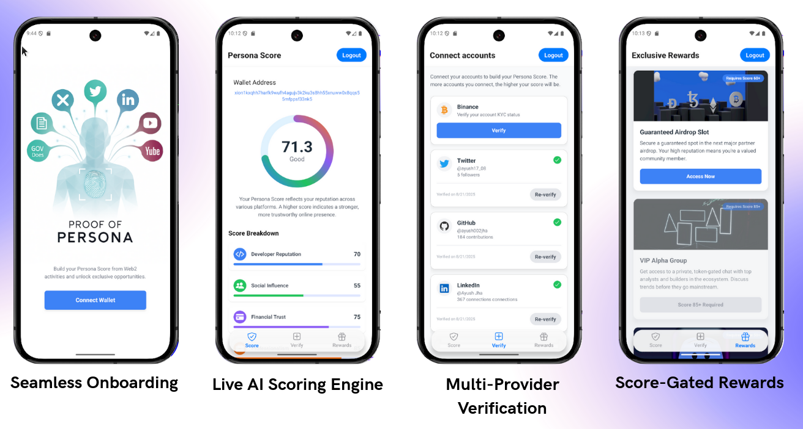
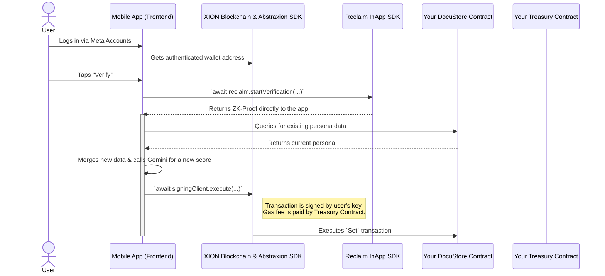

# Proof of Persona

[](https://xion.burnt.com/)

**Your Reputation, On-Chain.**

Proof of Persona is a decentralized identity platform built on the XION blockchain. We solve the "cold start" problem for Web3 users and provide robust Sybil resistance for dApps by creating a single, trustworthy on-chain reputation score from verified Web2 activities.

---

### App Showcase

<p align="center">
  
</p>

---

### Key Features

*   **Seamless Onboarding:** Log in with just an email, powered by XION's Meta Accounts.
*   **Private & Secure Verification:** Uses Reclaim Protocol's zkTLS to prove credentials from GitHub, Twitter, LinkedIn, and Binance without sharing private data.
*   **AI-Powered Scoring:** A Google Gemini-powered engine analyzes verified data to generate a nuanced on-chain Persona Score.
*   **Completely Gasless:** All user transactions, like updating their persona, are sponsored by a XION Treasury Contract.
*   **Composable On-Chain Data:** All verified data and scores are stored in a `DocuStore` contract, creating a transparent and reusable reputation layer.
*   **Score-Gated Rewards:** Demonstrates real-world utility by unlocking exclusive community rewards based on the user's score.

---

### System Flow Diagram

The application's architecture is designed to be secure and efficient, with all user-facing logic on the frontend and all on-chain state stored in smart contracts.



---

### Tech Stack

*   **Blockchain:** XION (Testnet)
*   **Smart Contracts:** `DocuStore`, XION Treasury Contract
*   **ZK-Proofs:** Reclaim Protocol (`@reclaimprotocol/inapp-rn-sdk`)
*   **AI Scoring:** Google Gemini (`@google/genai`)
*   **Mobile Framework:** React Native (Expo SDK)
*   **Navigation & State:** Expo Router, React Context
*   **Styling:** NativeWind (Tailwind CSS)
*   **UI Libraries:** `react-native-svg`, `react-native-linear-gradient`, `expo-blur`

---

### Getting Started

#### Prerequisites

*   Node.js (LTS) & NPM
*   Expo Go app on your mobile device
*   A funded XION Testnet wallet

#### Installation & Setup

1.  **Clone the repository:**
    ```bash
    git clone https://github.com/ayush002jha/proof-of-persona.git
    cd proof-of-persona
    ```

2.  **Install dependencies:**
    ```bash
    npm install
    ```

3.  **Set up Environment Variables:**
    Copy the example environment file and fill in your own keys and contract addresses.
    ```bash
    cp .env.example .env
    ```
    You will need to edit the `.env` file with your credentials.

4.  **Run the application:**
    This will start the Metro bundler. Scan the QR code with the Expo Go app.
    ```bash
    npx expo start -c
    ```

---

### Environment Variables

You need to create a `.env` file in the root of the project with the following variables:

```ini
# See .env.example
EXPO_PUBLIC_RECLAIM_APP_ID="YOUR_RECLAIM_APP_ID"
EXPO_PUBLIC_RECLAIM_APP_SECRET="YOUR_RECLAIM_APP_SECRET"
EXPO_PUBLIC_DOCUSTORE_CONTRACT_ADDRESS="YOUR_DOCUSTORE_CONTRACT_ADDRESS"
EXPO_PUBLIC_TREASURY_CONTRACT_ADDRESS="YOUR_TREASURY_CONTRACT_ADDRESS"
EXPO_PUBLIC_RPC_ENDPOINT="https://rpc.xion-testnet-2.burnt.com"
EXPO_PUBLIC_REST_ENDPOINT="https://api.xion-testnet-2.burnt.com"
EXPO_PUBLIC_GEMINI_API_KEY="YOUR_GOOGLE_GEMINI_API_KEY"
```

---

### License

This project is licensed under the MIT License.